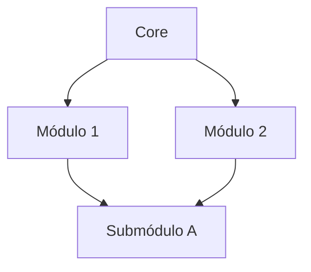

**shared-3d**

***

# Documentación Técnica

## Diagrama de Arquitectura

# Documentación Técnica

## README

**shared-3d**

***

# shared-3d

## Classes

- [CacheManager](classes/CacheManager.md)
- [SceneManager](classes/SceneManager.md)

## Interfaces

- [SceneProviderProps](interfaces/SceneProviderProps.md)

## Variables

- [SceneContext](variables/SceneContext.md)

## Functions

- [MaterialController](functions/MaterialController.md)
- [ModelLoader](functions/ModelLoader.md)
- [SceneProvider](functions/SceneProvider.md)
- [useCacheCleanup](functions/useCacheCleanup.md)
- [useScene](functions/useScene.md)
- [useSceneContext](functions/useSceneContext.md)
